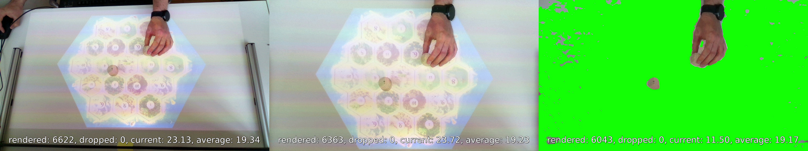
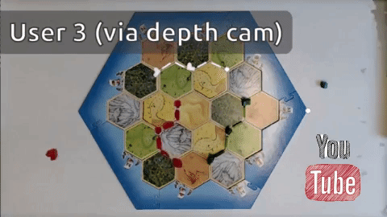

# SurfaceCast

SurfaceCast sends background-subtracted depth camera video via  (left: raw video, center: rectified, right: background removed).

This tool records live video of a flat surface with a depth camera, automatically detects the background plane, subtracts it from the video, and sends the result to a GStreamer pipeline. Everything that is part of the background within a configurable distance will turn bright green so it can be used with other GStreamer filters, e.g. using `alpha method=green` and `videomix`. Optionally, an arbitrary quadrilateral area in the raw image can be extracted and rectified before streaming (e.g. a projection screen).

### Usage

**Example 1** - debug/config view of plain webcam: `./surfacecast v4l2 /dev/video0`

**Example 2** - stream Realsense to : `./surfacecast realsense 0 "videoconvert ! video/x-raw,format=RGB,width=1280,height=720 ! v4l2sink device=/dev/video20"` (mind the quotes around the GStreamer pipeline)

For setting up the virtual camera, install `v4l2loopback-dkms`, copy `config/modules.conf` to `/etc/modules-load.d/` and `config/v4l2loopback.conf` to `/etc/modprobe.d/`, and run `sudo modprobe v4l2loopback`.

**Example 3** - simple network stream of Kinect Azure: `./surfacecast k4a 0 "jpegenc ! rtpjpegpay ! udpsink host=..."`

By default, 1280x720 RGB video data will be sent to the GStreamer pipeline `videoconvert ! fpsdisplaysink` to provide a debug view. If you want any other pipeline, pass it as a single quoted commandline parameter. In the debug view, the following hotkeys are available:

  * `space` - reset the perspective transformation
  * `mouse` - create new perspective transformation 
    * click the 4 corners of the desired quadrilateral area in succession
    * first click defines top-left corner, rest in clockwise order
  * `p` - re-run the RANSAC plane detection
  * `f` - toggle filtering of the background plane
  * `+` - increase the tolerance wrt background by 0.2cm
  * `-` - decrease the tolerance wrt background by 0.2cm
  * `s` - save current parameters (tolerance, perspective, plane) to `config.xml`
  * `q` - exit program

If `config.xml` is present in the working directory at startup, parameters are re-initialized with saved values.

### Supported/tested devices:

  * Generic Video4Linux2 camera (without background subtraction)
  * Samsung SUR40 (with brightness-based background subtraction)
  * Intel Realsense D415/D435
  * Microsoft Kinect Azure
  * Virtual Camera

### Build requirements:

Reference platform: Ubuntu 20.04.

  * General (V4L2, SUR40, virtual camera):
    * gstreamer-1.16 (`libgstreamer1.0-dev libgstreamer-plugins-base1.0-dev`)
    * opencv-4.2.0 (`libopencv-dev libeigen3-dev`)
  * Kinect Azure:
    * libk4a-1.4.1 (https://github.com/microsoft/Azure-Kinect-Sensor-SDK)
  * Realsense:
    * librealsense2-2.50 (https://github.com/IntelRealSense/librealsense)
  
### License

SurfaceCast is licensed under the GNU Lesser General Public License v3.0.

### random notes

  * camera USB bandwidth allocation is a problem
    * needs uvcvideo quirks parameter (see `uvcvideo.conf`) and limited FPS
    * check with: `$ cat /sys/kernel/debug/usb/devices | grep "B: "`
  * inconsistent camera device naming is fixed by `99-camera-symlink.rules`
  * default SUR40 table display size: 89x50cm
