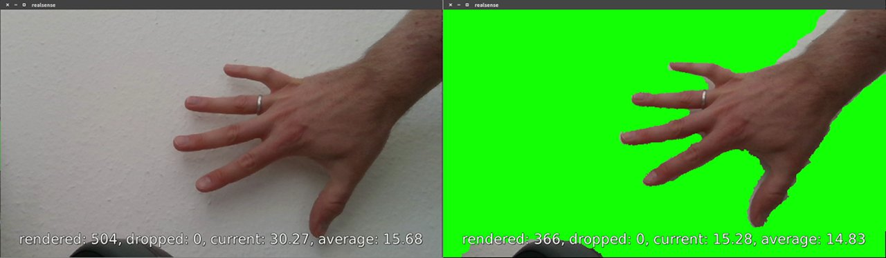

# SurfaceStreams

Sends background-subtracted depth camera video via  (left: raw video, right: background removed).

This tool records live video of a flat surface with a depth camera, automatically detects the background plane, subtracts that from the video, and sends the result to a GStreamer pipeline. Everything that is part of the background within a configurable distance will turn bright green so it can be used with other GStreamer filters, e.g. using `alpha method=green` and `videomix`. Optionally, an arbitrary quadrilateral area in the raw image can be extracted and rectified before streaming (e.g. a projection screen).

### Usage

By default, all executables will run the GStreamer pipeline `videoconvert ! fpsdisplaysink` to provide a debug view. If you want any other pipeline, pass it as a single commandline parameter, e.g. `./realsense "jpegenc ! rtpgstpay ! udpsink"` to stream the compressed view over a network. In the debug view, the following commands are available:

  * `space` - reset the perspective transformation
  * `mouse` - create new perspective transformation 
    * click the 4 corners of the desired quadrilateral area in succession
    * first click defines top-left corner, rest in clockwise order
    * transformation will be saved as `perspective.xml` in current directory
  * `p` - re-run the RANSAC plane detection
  * `f` - toggle filtering of the background plane
  * `+` - increase the tolerance wrt background by 0.2cm
  * `-` - decrease the tolerance wrt background by 0.2cm
  * `q` - exit program

### Supported/tested devices:

  * Intel Realsense D415
  * Microsoft Kinect v2
  * TBD: Samsung SUR40
  * Generic Video4Linux2 camera (without background subtraction)

### Library requirements:

  * gstreamer-1.0
  * opencv-3.4.1
  * librealsense-2.11 (https://github.com/IntelRealSense/librealsense)
  * libfreenect-0.2-gstreamer (https://github.com/floe/libfreenect2/tree/gstreamer)

### random notes

  * UDP ports:
    * 500x: surface stream, 1280x720, MJPEG in GStreamer buffers
    * 600x: front cam stream, 1280x720, MJPEG in GStreamer buffers
    * 700x: raw audio stream in GStreamer buffers
  * camera USB bandwidth allocation is a problem
    * needs uvcvideo quirks parameter (see `uvcvideo.conf`) and limited FPS
    * check with: `$ cat /sys/kernel/debug/usb/devices | grep "B: "`
  * inconsistent camera device naming is fixed by `99-camera-symlink.rules`
  * default table display size: 89x50cm
